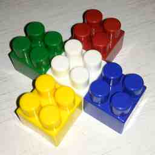

## Работа 1. Исследование гамма-коррекции
автор: Юркин П.О.
дата: 2021-02-28

<https://mysvn.ru/Maxim_Kaverin/anime/yurkin_p_o/prj.labs/lab02/>

### Задание

1. В качестве тестового использовать изображение data/cross_0256x0256.png
2. Сохранить тестовое изображение в формате JPEG с качеством 25%.
3. Используя cv::merge и cv::split сделать "мозаику" с визуализацией каналов для исходного тестового изображения и JPEG-версии тестового изображения

- левый верхний - трехканальное изображение
- левый нижний - монохромная (черно-зеленая) визуализация канала G
- правый верхний - монохромная (черно-красная) визуализация канала R
- правый нижний - монохромная (черно-синяя) визуализация канала B

4. Результы сохранить для вставки в отчет

### Результаты


Рис. 1. Тестовое изображение после сохранения в формате JPEG с качеством 25%


Рис. 2. Визуализация каналов исходного тестового изображения


Рис. 3. Визуализация каналов JPEG-версии тестового изображения

![]

Рис. 4. Визуализация гистограмм исходного и JPEG-версии тестового изображения

### Текст программы

```cpp
#include <opencv2/opencv.hpp>
#include <vector>
using namespace cv;

void SaveJpeg(const Mat& img, const std::string& pathToSave, const int& quality) {
	std::vector<int> compression;
	compression.push_back(IMWRITE_JPEG_QUALITY);
	compression.push_back(quality);
	imwrite(pathToSave, img, compression);
}

void Mosaic(Mat img, const std::string& pathToSave) {
	Mat img1, img2, img3;
	Mat empty = Mat::zeros(Size(img.cols, img.rows), CV_8UC1);
	//rgb r - 0, g - 1, b - 2
	//o r
	//g b 
	std::vector<Mat> channels(3);
	split(img, channels);

	std::vector<Mat> chan;
	chan.push_back(empty);
	chan.push_back(empty);
	chan.push_back(channels[2]);
	merge(chan, img1);
	chan.clear();

	chan.push_back(empty);
	chan.push_back(channels[1]);
	chan.push_back(empty);
	merge(chan, img2);
	chan.clear();

	chan.push_back(channels[0]);
	chan.push_back(empty);
	chan.push_back(empty);
	merge(chan, img3);

	hconcat(img, img1, img);
	hconcat(img2, img3, img2);
	vconcat(img, img2, img);
	imwrite(pathToSave, img);
}

Mat Histogram(const Mat& img, Mat output) {
	std::vector<int> vect(256);
	for (int i = 0; i < 256; i++) {
		for (int j = 0; j < 256; j++) {
			vect[img.at<uchar>(j, i)]++;
		}
	}
	int max = *max_element(vect.begin(), vect.end());
	for (int i = 0; i < 256; i++) {
		int h = vect[i] * 255 / max;
		Point p1(i * 2, 255 - h);
		Point p2(i * 2 + 1, 255);
		rectangle(output, p1, p2, 0);
	}
	return output;
}

int main()
{
	Mat img = imread("data_cross_0256x0256.png");
	std::string path = "cross_0256x0256_025.jpg";
	std::string path2 = "cross_0256x0256_png_channels.png";
	std::string path3 = "cross_0256x0256_jpg_channels.png";
	SaveJpeg(img, path, 25);
	Mat img2 = imread("cross_0256x0256_025.jpg");
	Mosaic(img, path2);
	Mosaic(img2, path3);
	
	Mat input(256, 512, CV_8U, 255);
	Mat input2(256, 512, CV_8U, 255);
	Mat store1, store2;
	store1 = Histogram(img, input);
	store2 = Histogram(img2, input2);
	vconcat(store1, store2, store1);
	imwrite("cross_0256x0256_hists.png", store1);
	waitKey(0);
	return 0;
}
```

