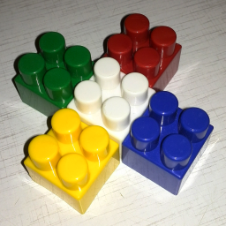

## Работа 3. Яркостные преобразования
автор: Миклашевская А. Д.
дата: 05.03.2021

https://mysvn.ru/Anna_Miklashevskaya/opencv/miklashevskaya_a_d/prj.labs/lab03/

### Задание
1. В качестве тестового использовать изображение data/cross_0256x0256.png
2. Сгенерировать нетривиальную новую функцию преобразования яркости (не стоит использовать линейную функцию, гамму, случайная).
3. Сгенерировать визуализацию функцию преобразования яркости в виде изображения размером 512x512, черные точки а белом фоне.
4. Преобразовать пиксели grayscale версии тестового изображения при помощи LUT для сгенерированной функции преобразования.
4. Преобразовать пиксели каждого канала тестового изображения при помощи LUT для сгенерированной функции преобразования.
5. Результы сохранить для вставки в отчет.

### Результаты


Рис. 1. Исходное тестовое изображение


Рис. 2. Тестовое изображение greyscale


Рис. 3. Результат применения функции преобразования яркости для greyscale


Рис. 4. Результат применения функции преобразования яркости для каналов


Рис. 5. Визуализация функции яркостного преобразования

### Текст программы

```cpp
#include <opencv2/opencv.hpp>
#include <vector>
#include <math.h>
#include <iostream>
using namespace cv;
using namespace std;

float func(float x) {
	return tan((CV_PI * x) / 4);
}

int main() {

	Mat img = imread("data_cross_0256x0256.png");
	imwrite("lab03_rgb.png", img);
	Mat bimg, gimg;
	//яркость
	vector<uchar> lut(256);
	for (int i = 0; i < 256; i++)
		lut[i] = func(i / (float)255) * 255;
	LUT(img, lut, bimg);
	imwrite("lab03_rgb_res.png", bimg);
	cvtColor(img, bimg, COLOR_BGR2GRAY);
	imwrite("lab03_gre.png", bimg);
	//яркость серому
	Mat bgimg;
	LUT(bimg, lut, bgimg);
	imwrite("lab03_gre_res.png", bgimg);
	//график
	Mat graph(512, 512, CV_8U, 255);
	for (int i = 0; i < 512; ++i) {
		graph.at<uchar>(511 - 511 * func(i / (float)511), i) = 0;
	}
	imwrite("lab03_viz_func.png", graph);
	waitKey(0);

	return 0;
}
```
